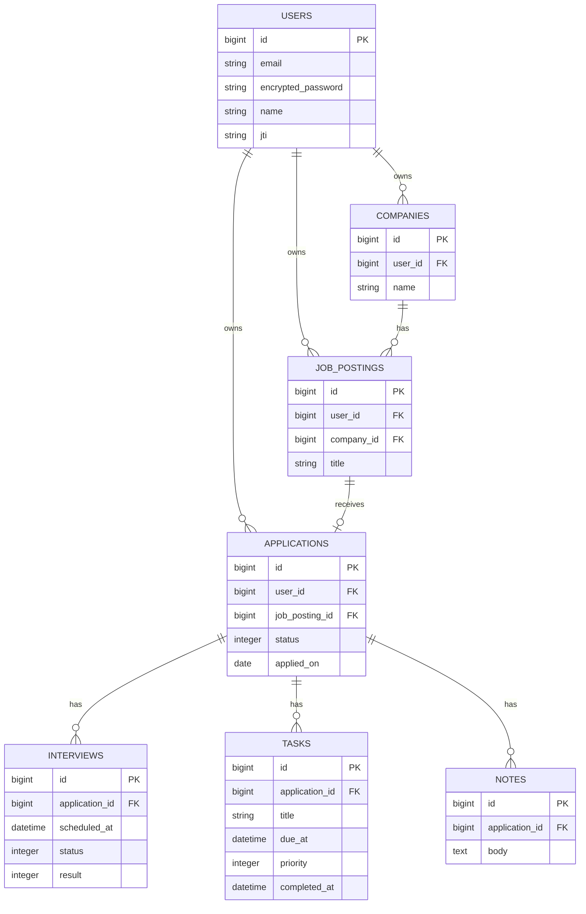

# JOBHUNTMANAGER

就職活動の応募状況を、カンバン形式で一元管理するSPAです。

会社名と応募日だけで応募カードを作成でき、選考状況の更新から面接・タスク・メモの管理までを、応募ごとにまとめて確認できます。

## アプリ概要

就職活動では、企業ごとに応募日、選考状況、面接予定、準備タスク、企業研究のメモなど、管理する情報が増えていきます。

JOBHUNTMANAGERは、それらの情報を応募単位で整理し、現在の選考状況を5列のカンバンで直感的に把握できるようにしたWebアプリです。

MVPでは入力負担を減らすため、カンバンから「会社名」と「応募日」だけで応募を登録できる設計にしています。

## デモアカウント

デプロイ後に動作確認を行う場合は、以下のアカウントを利用できます。

### ゲストユーザー1

- Email: `iamguest1@gmail.com`
- Password: `iamguest`

### ゲストユーザー2

- Email: `iamguest2@gmail.com`
- Password: `iamguest`

他ユーザーのデータは閲覧できないよう所有権制御を実装しています。

## デモ・スクリーンショット

- 公開デモURL: 準備中
- カンバン画面: スクリーンショット準備中
- 応募詳細画面: スクリーンショット準備中

## 作成背景

複数企業へ応募すると、求人サイト、メール、カレンダー、メモ帳などに情報が分散し、「次に何をすべきか」「どこまで選考が進んでいるか」が分かりにくくなります。

そこで、次の課題を解決することを目的に開発しました。

- 応募状況を一目で把握する
- 応募登録時の入力項目を最小限にする
- 面接、タスク、メモを応募ごとにまとめる
- ユーザーごとにデータを安全に分離する
- スマートフォンからPCまで利用できる画面にする

## 主な機能

### 認証

- ユーザー登録
- ログイン・ログアウト
- JWTによる認証状態の復元
- 未認証ユーザーの画面アクセス制御
- IP単位のレート制限によるログイン・ユーザー登録APIの保護

JWTはブラウザの`sessionStorage`に保存し、画面再読み込み時は`/api/v1/auth/me`で認証状態を復元します。

認証APIでは、ログインを1分あたり5回、ユーザー登録を1時間あたり3回まで同一IPから実行できます。上限を超えた場合は`429 Too Many Requests`を返します。

### カンバン

- 以下の5ステータスで応募状況を表示
  - 応募済み
  - 書類選考中
  - 面接予定
  - 内定
  - 見送り
- 会社名と応募日による簡易応募登録
- セレクトボックスによるステータス変更
- 各列の件数・空状態表示
- PCの画面幅に応じた横幅調整と横スクロール対応

### 応募詳細

- 応募日・現在のステータス表示
- 応募日の編集
- 応募の削除
- 応募に紐づく面接・タスク・メモの件数表示

### 面接管理

- 面接の登録・編集・削除
- 面接日時、面接種別、実施状況、選考結果の管理
- 場所、オンラインURL、担当者、補足情報の記録

### タスク管理

- タスクの登録・編集・削除
- 完了・未完了の切り替え
- 期限と優先度の管理
- 期限超過の表示

### メモ管理

- メモの登録・編集・削除
- 企業研究、面接所感、連絡事項などの自由記述
- 最大10,000文字の入力と文字数カウンター

## 画面構成

| 画面 | URL | 内容 |
| --- | --- | --- |
| ユーザー登録 | `/signup` | 名前、メールアドレス、パスワードの登録 |
| ログイン | `/login` | 登録済みユーザーのログイン |
| カンバン | `/kanban` | 応募一覧、簡易応募登録、ステータス変更 |
| 応募詳細 | `/applications/:id` | 応募情報、面接、タスク、メモの管理 |

## 使用技術

### Backend

| 技術 | 用途 |
| --- | --- |
| Ruby 3.3.10 | バックエンド言語 |
| Ruby on Rails 8.0 | JSON API |
| PostgreSQL | データベース |
| Devise | ユーザー認証 |
| devise-jwt | Bearer JWTの発行・失効 |
| JTIMatcher | ログアウト時のJWT失効管理 |
| Rack::Attack | 認証APIのIP単位レート制限 |
| rack-cors | React SPAとのCORS設定 |

### Frontend

| 技術 | 用途 |
| --- | --- |
| React 19 | UI構築 |
| TypeScript | 型安全なフロントエンド開発 |
| Vite | 開発サーバー・ビルド |
| Tailwind CSS v4 | スタイリング |
| Axios | Rails APIとの通信 |
| React Router | SPAのルーティング |
| Vitest | フロントエンドテスト |

### Quality

| ツール | 用途 |
| --- | --- |
| Rails Test | モデル・APIのテスト |
| RuboCop | Rubyの静的解析・コードスタイル |
| Brakeman | Railsの脆弱性チェック |
| Zeitwerk Check | Railsの定数・ファイル読み込み確認 |
| ESLint | TypeScript・Reactの静的解析 |

## システム構成

```text
React + TypeScript SPA
        │
        │ Axios / JSON / Bearer JWT
        ▼
Ruby on Rails API
        │
        ▼
PostgreSQL
```

- フロントエンドとバックエンドを分離したSPA構成です。
- 認証API以外はJWT認証を必須としています。
- APIから`user_id`を受け取らず、Railsの`current_user`を起点にデータを取得します。
- 他ユーザーが所有するリソースを指定した場合は`404 Not Found`を返します。

## DB設計概要



`companies`、`job_postings`、`applications`は`user_id`を持ちます。`interviews`、`tasks`、`notes`の所有者は、紐づく`application`を経由して判定します。

Applicationを削除した場合は配下の面接・タスク・メモを削除し、CompanyとJobPostingは子データが存在する場合に削除を拒否します。

詳しい設計は以下を参照してください。

- [MVP仕様書](docs/spec.md)
- [データベース設計書](docs/database_design.md)
- [API設計書](docs/api_design.md)

## API概要

すべてのAPIはJSONを返し、ベースパスに`/api/v1`を使用します。

| 分類 | HTTP | エンドポイント | 内容 |
| --- | --- | --- | --- |
| 認証 | POST | `/api/v1/auth` | ユーザー登録 |
| 認証 | POST | `/api/v1/auth/sign_in` | ログイン |
| 認証 | DELETE | `/api/v1/auth/sign_out` | ログアウト |
| 認証 | GET | `/api/v1/auth/me` | ログインユーザー取得 |
| 企業 | GET / POST | `/api/v1/companies` | 企業一覧・登録 |
| 求人 | GET / POST | `/api/v1/job_postings` | 求人一覧・登録 |
| 求人 | GET / PATCH / DELETE | `/api/v1/job_postings/:id` | 求人詳細・更新・削除 |
| 応募 | GET / POST | `/api/v1/applications` | 応募一覧・登録 |
| 応募 | GET / PATCH / DELETE | `/api/v1/applications/:id` | 応募詳細・応募日更新・削除 |
| カンバン | GET | `/api/v1/kanban` | ステータス別応募一覧 |
| 簡易応募 | POST | `/api/v1/kanban/applications` | 会社名・応募日から応募を登録 |
| ステータス | PATCH | `/api/v1/applications/:application_id/status` | 応募ステータス更新 |
| 面接 | GET / POST | `/api/v1/applications/:application_id/interviews` | 応募別面接一覧・登録 |
| 面接 | PATCH / DELETE | `/api/v1/interviews/:id` | 面接更新・削除 |
| タスク | GET / POST | `/api/v1/applications/:application_id/tasks` | 応募別タスク一覧・登録 |
| タスク | PATCH / DELETE | `/api/v1/tasks/:id` | タスク更新・削除 |
| メモ | GET / POST | `/api/v1/applications/:application_id/notes` | 応募別メモ一覧・登録 |
| メモ | PATCH / DELETE | `/api/v1/notes/:id` | メモ更新・削除 |

Companies API、JobPostings API、通常のApplications APIも実装済みです。ただし、現在のMVP画面では入力負担を抑えるため、会社・求人・応募を個別に登録せず、主にカンバンの簡易応募登録APIを使用します。

### 共通レスポンス

成功時:

```json
{
  "data": {
    "id": 1
  }
}
```

バリデーションエラー:

```json
{
  "error": {
    "code": "validation_error",
    "message": "入力内容を確認してください",
    "details": {
      "content": ["を入力してください"]
    }
  }
}
```

## セットアップ

### 必要な環境

- Ruby 3.3.10
- Bundler
- PostgreSQL（事前にインストールして起動）
- Node.js `^20.19.0` または `>=22.12.0`
- npm

### 1. リポジトリを取得

```powershell
git clone https://github.com/konohq/JOBHUNTMANAGER.git
cd JOBHUNTMANAGER
```

### 2. バックエンドの環境変数を設定

```powershell
cd backend
Copy-Item .env.example .env
```

作成した`backend/.env`へ、ローカル環境に合わせた値を設定してください。

PostgreSQLを起動した状態で作業してください。`DB_USERNAME`には、開発用・テスト用データベースを作成できる権限を持つPostgreSQLユーザーを指定します。

JWT秘密鍵は次のように生成できます。

```powershell
ruby -rsecurerandom -e "puts SecureRandom.hex(64)"
```

### 3. バックエンドをセットアップ

```powershell
bundle install
bundle exec rails db:prepare
bundle exec rails server
```

Rails APIは`http://localhost:3000`で起動します。

### 4. フロントエンドの環境変数を設定

別のターミナルを開いて実行します。

```powershell
cd frontend
Copy-Item .env.example .env
```

### 5. フロントエンドをセットアップ

```powershell
npm install
npm run dev
```

React SPAは`http://localhost:5173`で起動します。

PowerShellの実行ポリシーにより`npm`が実行できない場合は、`npm.cmd`を使用してください。

```powershell
npm.cmd run dev
```

## 環境変数

### Backend: `backend/.env`

| 変数名 | 例 | 用途 |
| --- | --- | --- |
| `DB_USERNAME` | `postgres` | PostgreSQLユーザー名。DB作成権限が必要 |
| `DB_PASSWORD` | `your_database_password` | PostgreSQLパスワード |
| `DEVISE_JWT_SECRET_KEY` | ランダムな長い文字列 | JWTの署名 |
| `FRONTEND_ORIGIN` | `http://localhost:5173` | CORSで許可するSPAのオリジン |

### Backend: Render本番環境

| 変数名 | 設定値 | 用途 |
| --- | --- | --- |
| `DATABASE_URL` | Render PostgreSQLのInternal Database URL | 本番データベース接続 |
| `DEVISE_JWT_SECRET_KEY` | 本番用に生成した長いランダム文字列 | JWTの署名 |
| `FRONTEND_ORIGIN` | デプロイしたReact SPAのオリジン | CORSで許可する接続元 |
| `RAILS_MASTER_KEY` | `backend/config/master.key`の内容 | Rails Credentialsの復号 |
| `RAILS_ENV` | `production` | Railsの実行環境 |
| `RAILS_MAX_THREADS` | `3` | PumaとDB接続プールのスレッド数 |

Render上では`DB_USERNAME`、`DB_PASSWORD`を個別に設定せず、`DATABASE_URL`へRender PostgreSQLのInternal Database URLを設定します。`DATABASE_URL`、JWT秘密鍵、`RAILS_MASTER_KEY`はGitHubへコミットしないでください。

### Frontend: `frontend/.env`

| 変数名 | 例 | 用途 |
| --- | --- | --- |
| `VITE_API_BASE_URL` | `http://localhost:3000` | Rails APIの接続先 |

`.env`はGitの管理対象外です。実際のパスワードやJWT秘密鍵はコミットせず、`.env.example`にはサンプル値のみを記載します。

`VITE_`で始まる環境変数は、ビルド後のJavaScriptから参照できる公開情報です。API URLなどに限定し、パスワード、JWT秘密鍵、APIキーなどの秘密情報は設定しないでください。

### 認証APIのレート制限

同一IPからの過剰な認証リクエストを抑止します。

| 対象 | 上限 |
| --- | --- |
| `POST /api/v1/auth/sign_in` | 1分あたり5回 |
| `POST /api/v1/auth` | 1時間あたり3回 |

上限超過時:

```json
{
  "error": {
    "code": "rate_limit_exceeded",
    "message": "リクエスト回数が上限を超えました。時間をおいて再度お試しください"
  }
}
```

レスポンスは`429 Too Many Requests`となり、再試行までの秒数を`Retry-After`ヘッダーで返します。

## テスト・静的解析

### Backend

```powershell
cd backend

bundle exec rails db:test:prepare
bundle exec rails test
bundle exec rubocop
bundle exec brakeman --no-pager
bundle exec rails zeitwerk:check
```

### Frontend

```powershell
cd frontend

npm run test
npm run build
npm run lint
```

PowerShellで`npm.ps1`が制限されている場合:

```powershell
npm.cmd run test
npm.cmd run build
npm.cmd run lint
```

### 差分チェック

```powershell
git diff --check
```

## 工夫した点

### 入力負担を抑えた簡易応募登録

通常はCompany、JobPosting、Applicationの3つのデータが必要ですが、利用者は会社名と応募日だけを入力します。

Rails側のサービスクラスで3レコードをトランザクション内に作成し、途中で失敗した場合はすべてロールバックします。同一ユーザー内に同名企業が存在する場合はCompanyを再利用し、重複応募を防いでいます。

### ユーザー単位の認可

リクエストから`user_id`を受け取らず、`current_user.companies`や`current_user.applications`を起点にデータを取得します。

面接・タスク・メモは`user_id`を重複して持たず、Applicationとの関連を使って所有権を判定しています。

### SPA向けJWT認証

Deviseとdevise-jwtのJTIMatcherを使用し、JWTの発行と失効を実装しています。

フロントエンドではJWTを`sessionStorage`へ保存し、AxiosのinterceptorでAuthorizationヘッダーを付与します。`401 Unauthorized`を受け取った場合は認証状態を解除します。

### カンバン表示に適したAPI

カンバンAPIは5ステータスを常に返し、応募がない列も空配列として扱います。各列は`updated_at DESC`、同時刻の場合は`id DESC`で表示します。

同一列内の手動並び替えはMVPに含めず、まず選考状況を迷わず管理できることを優先しました。

### 安全な非同期状態管理

面接、タスク、メモの更新処理では、通信中のリソースIDを`Set<number>`で管理しています。複数の操作が並行しても、別の通信完了によって操作中状態が誤って解除されないようにしています。

### APIとUIの責務分離

フロントエンドは機能単位でAPI、型定義、フォーム、一覧コンポーネントを分離しています。共通のAxiosクライアントへJWT付与と401処理を集約し、画面コンポーネントが通信の詳細を持ちすぎない構成にしています。

## 今後の追加予定

- 面接予定の横断一覧画面
- 未完了・期限超過タスクの横断一覧画面
- 検索・絞り込み
- ページネーション
- カレンダー表示・外部カレンダー連携
- 通知機能
- タグ機能
- ファイル添付
- CSV入出力
- カンバンのドラッグ＆ドロップ
- 同一列内の手動並び替え
- 企業・求人情報の詳細管理画面
- パスワード再設定
- アカウント設定・退会
- レスポンシブUIとアクセシビリティの継続改善
- 本番環境へのデプロイ

## ディレクトリ構成

```text
job-hunt-manager/
├── backend/       # Ruby on Rails API
├── frontend/      # React + TypeScript SPA
├── docs/          # 仕様書・DB設計書・API設計書
└── README.md
```
