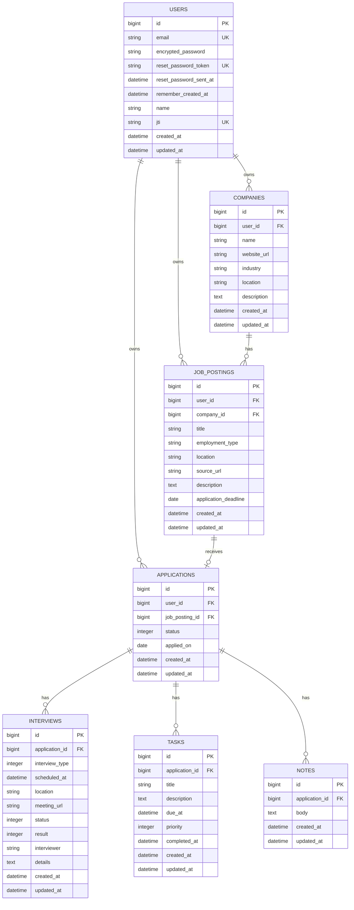

# JOBHUNTMANAGER MVPデータベース設計書

## 1. 概要

本書は [`spec.md`](./spec.md) に基づくMVPのデータベース設計を定義する。

既存の `users` テーブルへJTIMatcher用の `jti` を追加し、以下のテーブルを新規作成する。

- `companies`
- `job_postings`
- `applications`
- `interviews`
- `tasks`
- `notes`

### 所有者管理

- `companies`、`job_postings`、`applications` は `user_id` を持つ
- `interviews`、`tasks`、`notes` は `user_id` を持たない
- 子リソースの所有者は `application.user_id` から判定する
- `user_id` はAPIリクエストから受け取らない

---

## 2. ER図



---

## 3. テーブル定義

### 3.1 users

Deviseで作成済みのテーブルへ `jti` を追加する。

| カラム | Rails型 | NULL | デフォルト | キー | 説明 |
| --- | --- | --- | --- | --- | --- |
| id | bigint | NO | 自動採番 | PK | ユーザーID |
| email | string | NO | `""` | UNIQUE | ログインID |
| encrypted_password | string | NO | `""` | － | 暗号化済みパスワード |
| reset_password_token | string | YES | NULL | UNIQUE | Devise既存カラム |
| reset_password_sent_at | datetime | YES | NULL | － | Devise既存カラム |
| remember_created_at | datetime | YES | NULL | － | Devise既存カラム |
| name | string | YES | NULL | － | 表示名。モデルでは必須 |
| jti | string | NO | － | UNIQUE | JTIMatcher用識別子 |
| created_at | datetime | NO | － | － | 作成日時 |
| updated_at | datetime | NO | － | － | 更新日時 |

`jti` はユーザーごとに一意なUUID文字列を保存する。

### 3.2 companies

| カラム | Rails型 | NULL | デフォルト | キー | 説明 |
| --- | --- | --- | --- | --- | --- |
| id | bigint | NO | 自動採番 | PK | 企業ID |
| user_id | references | NO | － | FK、INDEX | 所有ユーザー |
| name | string | NO | － | INDEX | 企業名 |
| website_url | string | YES | NULL | － | 企業Webサイト |
| industry | string | YES | NULL | － | 業界 |
| location | string | YES | NULL | － | 所在地 |
| description | text | YES | NULL | － | 企業概要 |
| created_at | datetime | NO | － | － | 作成日時 |
| updated_at | datetime | NO | － | － | 更新日時 |

既存の企業APIとの互換性を保つため、`[user_id, name]` はDBユニーク制約にしない。

カンバンの簡易応募登録では入力された会社名の前後空白を除去し、同じユーザー内に同名企業があれば最初のCompanyを再利用する。簡易応募登録経由では同一会社名への重複応募を許可しない。

### 3.3 job_postings

| カラム | Rails型 | NULL | デフォルト | キー | 説明 |
| --- | --- | --- | --- | --- | --- |
| id | bigint | NO | 自動採番 | PK | 求人ID |
| user_id | references | NO | － | FK、INDEX | 所有ユーザー |
| company_id | references | NO | － | FK、INDEX | 対象企業 |
| title | string | NO | － | － | 職種・求人名 |
| employment_type | string | YES | NULL | － | 雇用形態 |
| location | string | YES | NULL | － | 勤務地 |
| source_url | string | YES | NULL | － | 求人ページURL |
| description | text | YES | NULL | － | 求人内容 |
| application_deadline | date | YES | NULL | － | 応募期限 |
| created_at | datetime | NO | － | － | 作成日時 |
| updated_at | datetime | NO | － | － | 更新日時 |

給与カラムはMVPでは作成しない。

整合性:

- `company_id` はログインユーザーが所有する企業を指定する
- `job_posting.user_id` と `company.user_id` は一致させる

### 3.4 applications

| カラム | Rails型 | NULL | デフォルト | キー | 説明 |
| --- | --- | --- | --- | --- | --- |
| id | bigint | NO | 自動採番 | PK | 応募ID |
| user_id | references | NO | － | FK、INDEX | 所有ユーザー |
| job_posting_id | references | NO | － | FK、UNIQUE | 対象求人 |
| status | integer | NO | `0` | INDEX | 応募ステータス |
| applied_on | date | NO | － | － | 応募日 |
| created_at | datetime | NO | － | － | 作成日時 |
| updated_at | datetime | NO | － | INDEX | 更新日時・列内表示順 |

`status`:

| DB値 | enum名 | 表示名 |
| --- | --- | --- |
| 0 | `applied` | 応募済み |
| 1 | `document_screening` | 書類選考中 |
| 2 | `interview_scheduled` | 面接予定 |
| 3 | `offered` | 内定 |
| 4 | `rejected` | 見送り |

整合性:

- `job_posting_id` をユニークにし、1求人につき応募は最大1件とする
- `application.user_id` と `job_posting.user_id` は一致させる
- 簡易応募登録では同じユーザーの同一会社名への応募を最大1件とする
- カンバンは `[user_id, status, updated_at]` で取得する
- `position` カラムは作成しない
- 選考結果などの自由記述は `notes` に保存する

### 3.5 interviews

| カラム | Rails型 | NULL | デフォルト | キー | 説明 |
| --- | --- | --- | --- | --- | --- |
| id | bigint | NO | 自動採番 | PK | 面接ID |
| application_id | references | NO | － | FK、INDEX | 対象応募 |
| interview_type | integer | NO | `0` | － | 面接種別 |
| scheduled_at | datetime | NO | － | INDEX | 実施予定日時 |
| location | string | YES | NULL | － | 面接会場 |
| meeting_url | string | YES | NULL | － | オンライン面接URL |
| status | integer | NO | `0` | － | 面接状態 |
| result | integer | NO | `0` | － | 選考結果 |
| interviewer | string | YES | NULL | － | 面接担当者 |
| details | text | YES | NULL | － | 準備事項、所感、補足 |
| created_at | datetime | NO | － | － | 作成日時 |
| updated_at | datetime | NO | － | － | 更新日時 |

`interview_type`:

| DB値 | enum名 | 表示名 |
| --- | --- | --- |
| 0 | `casual` | カジュアル面談 |
| 1 | `first` | 一次面接 |
| 2 | `second` | 二次面接 |
| 3 | `final` | 最終面接 |
| 4 | `other` | その他 |

`status`:

| DB値 | enum名 | 表示名 |
| --- | --- | --- |
| 0 | `scheduled` | 予定 |
| 1 | `completed` | 完了 |
| 2 | `canceled` | 中止 |

`result`:

| DB値 | enum名 | 表示名 |
| --- | --- | --- |
| 0 | `pending` | 未確定 |
| 1 | `passed` | 通過 |
| 2 | `failed` | 不通過 |

面接を登録・更新しても、`application.status` は自動変更しない。

### 3.6 tasks

| カラム | Rails型 | NULL | デフォルト | キー | 説明 |
| --- | --- | --- | --- | --- | --- |
| id | bigint | NO | 自動採番 | PK | タスクID |
| application_id | references | NO | － | FK、INDEX | 対象応募 |
| title | string | NO | － | － | タスク名 |
| description | text | YES | NULL | － | 詳細 |
| due_at | datetime | YES | NULL | INDEX | 期限 |
| priority | integer | NO | `1` | － | 優先度 |
| completed_at | datetime | YES | NULL | INDEX | 完了日時 |
| created_at | datetime | NO | － | － | 作成日時 |
| updated_at | datetime | NO | － | － | 更新日時 |

`priority`:

| DB値 | enum名 | 表示名 |
| --- | --- | --- |
| 0 | `low` | 低 |
| 1 | `medium` | 中 |
| 2 | `high` | 高 |

`completed_at` がNULLなら未完了として扱う。

### 3.7 notes

| カラム | Rails型 | NULL | デフォルト | キー | 説明 |
| --- | --- | --- | --- | --- | --- |
| id | bigint | NO | 自動採番 | PK | メモID |
| application_id | references | NO | － | FK、INDEX | 対象応募 |
| body | text | NO | － | － | メモ本文 |
| created_at | datetime | NO | － | INDEX | 作成日時 |
| updated_at | datetime | NO | － | － | 更新日時 |

---

## 4. モデル関連付け

### User

```ruby
include Devise::JWT::RevocationStrategies::JTIMatcher

devise :database_authenticatable,
       :registerable,
       :recoverable,
       :rememberable,
       :validatable,
       :jwt_authenticatable,
       jwt_revocation_strategy: self

has_many :companies, dependent: :restrict_with_error
has_many :job_postings, dependent: :restrict_with_error
has_many :applications, dependent: :restrict_with_error
```

### Company

```ruby
belongs_to :user

has_many :job_postings, dependent: :restrict_with_error
```

### JobPosting

```ruby
belongs_to :user
belongs_to :company

has_one :application, dependent: :restrict_with_error
```

### Application

```ruby
belongs_to :user
belongs_to :job_posting

has_many :interviews, dependent: :destroy
has_many :tasks, dependent: :destroy
has_many :notes, dependent: :destroy
```

### Interview

```ruby
belongs_to :application
```

### Task

```ruby
belongs_to :application
```

### Note

```ruby
belongs_to :application
```

---

## 5. 削除方針と外部キー

### 削除方針

| 親 | 子がある場合 |
| --- | --- |
| User | 削除拒否。アカウント削除はMVP対象外 |
| Company | JobPostingがあれば削除拒否 |
| JobPosting | Applicationがあれば削除拒否 |
| Application | Interview、Task、Noteを連鎖削除 |

### 外部キー

| 子カラム | 参照先 | `ON DELETE` |
| --- | --- | --- |
| companies.user_id | users.id | RESTRICT |
| job_postings.user_id | users.id | RESTRICT |
| job_postings.company_id | companies.id | RESTRICT |
| applications.user_id | users.id | RESTRICT |
| applications.job_posting_id | job_postings.id | RESTRICT |
| interviews.application_id | applications.id | CASCADE |
| tasks.application_id | applications.id | CASCADE |
| notes.application_id | applications.id | CASCADE |

CompanyとJobPostingは履歴の誤削除を防ぐ。Applicationは利用者の確認後に削除し、配下データを残さない。

---

## 6. インデックス

`references` が作成する単一カラムインデックスに加え、以下を作成する。

| テーブル | カラム | UNIQUE | 用途 |
| --- | --- | --- | --- |
| users | jti | YES | JWT照合 |
| companies | user_id, name | NO | 企業選択一覧 |
| applications | job_posting_id | YES | 1求人1応募の保証 |
| applications | user_id, status, updated_at | NO | カンバン取得 |
| interviews | scheduled_at | NO | 面接予定一覧 |
| tasks | completed_at, due_at | NO | 未完了・期限超過一覧 |
| notes | application_id, created_at | NO | 応募別メモ一覧 |

---

## 7. 所有者判定

### 直接所有するリソース

```ruby
current_user.companies.find(params[:id])
current_user.job_postings.find(params[:id])
current_user.applications.find(params[:id])
```

### Application配下のリソース

Interview、Task、Noteは、先にログインユーザーのApplicationへスコープして取得する。

```ruby
application = current_user.applications.find(params[:application_id])
application.interviews.find(params[:id])
```

親IDをURLに含まない更新・削除APIでは、ApplicationとのJOINで取得する。

```ruby
Interview
  .joins(:application)
  .where(applications: { user_id: current_user.id })
  .find(params[:id])
```

実装時は重複を避けるため、子リソース取得用のprivateメソッドまたはQuery Objectへ共通化する。

### 7.1 カンバン簡易応募登録の整合性

簡易応募登録は新しいテーブルやカラムを追加せず、既存のCompany、JobPosting、Applicationを使用する。

```ruby
ApplicationRecord.transaction do
  current_user.lock!

  # 同一会社名への既存応募を確認
  # Companyを再利用または作成
  # 内部用JobPostingを作成
  # Applicationを作成
end
```

- `current_user` の行ロックにより、同一ユーザーの簡易応募登録を直列化する
- Company、JobPosting、Applicationのいずれかで作成に失敗した場合はすべてロールバックする
- 同一会社名への応募制約は簡易応募登録サービスで検証する
- 通常の求人APIを利用した応募では、既存の `applications.job_posting_id` ユニーク制約を使用する
- 簡易応募登録のJobPostingは内部レコードとして `title` に会社名を保存する
- 簡易応募登録で入力された応募日は `applications.applied_on` に保存する

---

## 8. migration作成コマンド

`backend` ディレクトリで実行する。

```powershell
cd D:\RubyProjects\job-hunt-manager\backend
```

### 8.1 usersへjtiを追加

```powershell
bin\rails generate migration AddJtiToUsers jti:string
```

生成されたmigrationで、既存ユーザーへUUIDを設定してからNOT NULL・ユニーク制約を追加する。

```ruby
class AddJtiToUsers < ActiveRecord::Migration[8.0]
  class MigrationUser < ActiveRecord::Base
    self.table_name = "users"
  end

  def up
    add_column :users, :jti, :string

    MigrationUser.reset_column_information
    MigrationUser.find_each do |user|
      user.update_columns(jti: SecureRandom.uuid)
    end

    change_column_null :users, :jti, false
    add_index :users, :jti, unique: true
  end

  def down
    remove_index :users, :jti
    remove_column :users, :jti
  end
end
```

新規ユーザーの `jti` はJTIMatcherにより生成する。

### 8.2 companies

```powershell
bin\rails generate model Company user:references name:string website_url:string industry:string location:string description:text
```

### 8.3 job_postings

```powershell
bin\rails generate model JobPosting user:references company:references title:string employment_type:string location:string source_url:string description:text application_deadline:date
```

### 8.4 applications

```powershell
bin\rails generate model Application user:references job_posting:references status:integer applied_on:date
```

### 8.5 interviews

```powershell
bin\rails generate model Interview application:references interview_type:integer scheduled_at:datetime location:string meeting_url:string status:integer result:integer interviewer:string details:text
```

### 8.6 tasks

```powershell
bin\rails generate model Task application:references title:string description:text due_at:datetime priority:integer completed_at:datetime
```

### 8.7 notes

```powershell
bin\rails generate model Note application:references body:text
```

---

## 9. migration編集内容

生成後、実行前にNOT NULL、デフォルト値、外部キー削除動作、複合インデックスを設定する。

### 必須カラムとデフォルト値

```ruby
# applications
t.integer :status, null: false, default: 0
t.date :applied_on, null: false

# interviews
t.integer :interview_type, null: false, default: 0
t.datetime :scheduled_at, null: false
t.integer :status, null: false, default: 0
t.integer :result, null: false, default: 0

# tasks
t.string :title, null: false
t.integer :priority, null: false, default: 1

# notes
t.text :body, null: false
```

次のカラムも `null: false` とする。

- すべての `references`
- `companies.name`
- `job_postings.title`

### 外部キー

RESTRICT対象:

```ruby
t.references :user, null: false, foreign_key: { on_delete: :restrict }
t.references :company, null: false, foreign_key: { on_delete: :restrict }
```

`applications.job_posting_id` は後述のユニークインデックス付き定義を使用する。

CASCADE対象:

```ruby
t.references :application,
             null: false,
             foreign_key: { on_delete: :cascade }
```

### 複合インデックス

```ruby
add_index :companies, %i[user_id name]
add_index :applications, %i[user_id status updated_at]
add_index :interviews, :scheduled_at
add_index :tasks, %i[completed_at due_at]
add_index :notes, %i[application_id created_at]
```

`applications.job_posting_id` は、生成された `t.references` のインデックスをユニークに変更する。

```ruby
t.references :job_posting,
             null: false,
             foreign_key: { on_delete: :restrict },
             index: { unique: true }
```

---

## 10. migration実行・確認

```powershell
bin\rails db:migrate
bin\rails db:migrate:status
bin\rails db:schema:dump
```

確認項目:

- `users.jti` がNOT NULLかつUNIQUE
- `interviews`、`tasks`、`notes` に `user_id` がない
- `applications` に `position` と自由記述結果カラムがない
- `interviews.result` が存在する
- Company、JobPosting関連の外部キーがRESTRICT
- Application配下の外部キーがCASCADE
- カンバン取得用インデックスが存在する

---

## 11. バリデーション方針

### Company

- `name`: 必須、最大255文字
- `website_url`: URL形式、最大2048文字
- 簡易応募登録時は `name` の前後空白を除去する

### JobPosting

- `title`: 必須、最大255文字
- `source_url`: URL形式、最大2048文字
- 所有ユーザーと企業の所有ユーザーが一致する

### Application

- `applied_on`: 必須
- `job_posting_id`: ユーザー内で一意
- 所有ユーザーと求人の所有ユーザーが一致する
- 簡易応募登録では同じユーザーの同一会社名への既存応募がないこと

### Interview

- `scheduled_at`: 必須
- enum値が定義範囲内
- 面接作成時に応募ステータスを変更しない

### Task

- `title`: 必須、最大255文字
- enum値が定義範囲内

### Note

- `body`: 必須
- 空白のみを許可しない
