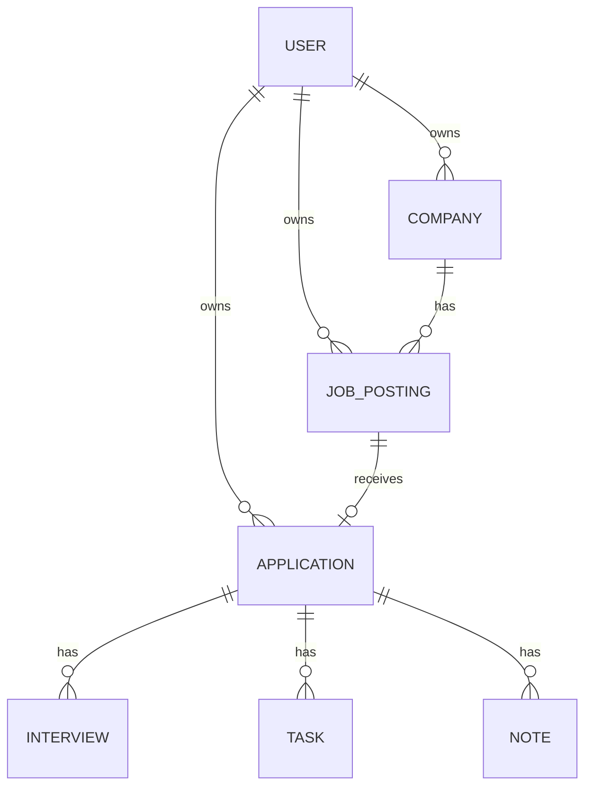

# JOBHUNTMANAGER MVP仕様書

## 1. 概要

JOBHUNTMANAGERは、ユーザーごとの就職活動を管理するカンバン式SPAアプリである。

MVPでは、会社名と応募期限だけで応募カードを登録し、応募状況をカンバンで管理し、応募に紐づく面接・タスク・メモを記録できる状態を完成条件とする。

### 技術構成

- バックエンド: Ruby on Rails API
- フロントエンド: React / TypeScript
- スタイリング: Tailwind CSS
- データベース: PostgreSQL
- 認証: Devise / devise-jwt / JTIMatcher

### MVPの基本方針

- Rails APIはRESTfulに実装する
- React側で画面遷移を行う
- ユーザーごとにデータを分離する
- カンバン専用テーブルは作成しない
- カンバンでは応募ステータスの変更のみ行う
- 同一列内の並び順は `updated_at DESC` とする
- 最初の完成に不要な検索、ページネーション、高度な集計は実装しない

---

## 2. 認証仕様

MVPでは `devise-jwt` とJTIMatcherを使用したBearer JWT認証を採用する。

### 認証フロー

1. ユーザー登録またはログインに成功する
2. Rails APIがレスポンスの `Authorization` ヘッダーへJWTを設定する
3. ReactがJWTを `sessionStorage` に保存する
4. 認証が必要なAPIへ `Authorization: Bearer <JWT>` を付与する
5. 画面再読み込み時は `sessionStorage` のJWTを使用して `/api/v1/auth/me` を呼び、認証状態を復元する
6. ログアウト成功時はJWTを失効させ、`sessionStorage` から削除する

### 認証上の制約

- `users` テーブルへJTIMatcher用の `jti` カラムを追加する
- JWTは `localStorage` へ保存しない
- JWTはブラウザタブを閉じるまで有効な `sessionStorage` に保存する
- APIキー認証は採用しない
- Cookie認証は採用しない
- 本番環境ではHTTPSを必須とする
- CORSはReactアプリのオリジンのみに制限する
- CORSの公開ヘッダーに `Authorization` を含める

---

## 3. MVPの機能一覧

### 3.1 ユーザー認証

- ユーザー登録
- ログイン
- ログアウト
- ログインユーザー情報の取得
- 画面再読み込み時の認証状態復元
- 未認証ユーザーの管理画面アクセス制限

### 3.2 企業・求人データの内部管理

- カンバンの「応募済み」列から会社名と応募期限を入力する
- RailsがCompany、JobPosting、Applicationを1トランザクションで作成する
- 同じユーザー内に同名企業がある場合はCompanyを再利用する
- JobPostingは既存DB設計との互換性を保つ内部レコードとして作成する
- 既存の企業API・求人APIは削除しない

企業専用画面と求人管理画面はMVPでは使用しない。求人名、雇用形態、勤務地、求人URL、求人内容を利用者が管理する画面はMVP後に実装する。

### 3.3 応募管理

- 会社名と応募期限による簡易応募登録
- 応募日と応募ステータスの管理
- 応募詳細の表示
- 応募情報の編集・削除
- 同じユーザーによる同一求人への重複応募防止
- 同じユーザーによる同一会社名への重複応募防止

### 3.4 カンバン

- 応募を以下のステータス別に表示
- カード内のセレクトボックスによるステータス変更
- 各列の応募を `updated_at DESC` で表示

カンバンステータス:

1. 応募済み
2. 書類選考中
3. 面接予定
4. 内定
5. 見送り

同一列内の手動並び替えと表示順保存はMVPでは実装しない。

### 3.5 面接管理

- 応募ごとの面接登録・編集・削除
- 今後の面接予定一覧
- 面接種別、実施日時、場所、オンラインURL、担当者、状態、選考結果、補足の管理
- 面接登録時に応募ステータスを自動変更しない

### 3.6 タスク管理

- 応募ごとのタスク登録・編集・削除
- 未完了タスク一覧
- 期限、優先度、完了状態の管理
- 期限超過の表示

### 3.7 メモ管理

- 応募ごとのメモ一覧
- メモの登録・編集・削除
- 面接所感、企業研究、連絡事項などの自由記述

応募の補足情報はメモへ集約し、`applications` に選考結果用の自由記述カラムは持たせない。

---

## 4. 画面一覧

| 画面 | パス案 | 主な機能 |
| --- | --- | --- |
| ユーザー登録 | `/signup` | 名前、メールアドレス、パスワードの登録 |
| ログイン | `/login` | ログイン |
| カンバン | `/kanban` | 応募一覧、簡易応募登録、ステータス変更 |
| 応募詳細 | `/applications/:id` | 応募、面接、タスク、メモの表示・管理 |
| 面接予定一覧 | `/interviews` | 今後の面接予定 |
| タスク一覧 | `/tasks` | 未完了、完了、期限超過タスク |

企業専用画面、求人管理画面、パスワード再設定画面、アカウント設定画面はMVP対象外とする。

---

## 5. ユーザーフロー

### 5.1 初回利用

1. ユーザー登録を行う
2. JWTを `sessionStorage` に保存する
3. 空のカンバンを表示する
4. 「応募済み」列の＋ボタンを押す
5. 会社名と任意の応募期限を入力する
6. Reactが簡易応募登録APIを1回呼ぶ
7. 応募カードが「応募済み」列に表示される

### 5.2 簡易応募を登録する

1. Railsが会社名の前後空白を除去する
2. 同じユーザー内に同名企業への応募があれば `422 Unprocessable Entity` を返す
3. 同名企業が存在すればCompanyを再利用し、存在しなければ作成する
4. 内部用JobPostingとApplicationを作成する
5. 作成したカンバンカードを返す

Company、JobPosting、Applicationの作成は `ApplicationRecord.transaction` 内で行い、途中で失敗した場合はすべてロールバックする。

### 5.3 応募状況を更新する

1. カンバン画面を開く
2. 応募カード内のステータスを選択する
3. ステータス変更専用APIで `status` のみ更新する
4. 移動した応募は更新先の列の先頭へ表示する

### 5.4 面接・タスク・メモを管理する

1. 応募詳細を開く
2. 面接、タスク、メモを登録・更新する
3. 必要に応じて応募ステータスを利用者が手動変更する

面接登録による応募ステータスの自動変更は行わない。

### 5.5 再読み込み時の認証復元

1. Reactが `sessionStorage` からJWTを取得する
2. `/api/v1/auth/me` を呼ぶ
3. 成功時はログイン状態を復元する
4. `401 Unauthorized` の場合はJWTを削除し、ログイン画面へ遷移する

---

## 6. データモデル概要

### users

Deviseで作成済みのユーザー。JTIMatcher用の `jti` を追加する。

### companies

ユーザーが登録した企業。`user_id` を持つ。

### job_postings

企業に紐づく求人。`user_id` と `company_id` を持つ。簡易応募登録では会社名を内部用の `title` として保存する。

給与情報はMVPでは扱わない。

### applications

求人への応募。`user_id` と `job_posting_id` を持ち、カンバンカードとして表示する。

同一列内の並び順カラムは持たない。

### interviews

応募に紐づく面接。`user_id` は持たず、`application` 経由で所有者を判定する。

### tasks

応募に紐づくタスク。`user_id` は持たず、`application` 経由で所有者を判定する。

### notes

応募に紐づくメモ。`user_id` は持たず、`application` 経由で所有者を判定する。

---

## 7. モデル関連図



### Railsモデルの関連

```text
User
├── has_many :companies
├── has_many :job_postings
└── has_many :applications

Company
├── belongs_to :user
└── has_many :job_postings

JobPosting
├── belongs_to :user
├── belongs_to :company
└── has_one :application

Application
├── belongs_to :user
├── belongs_to :job_posting
├── has_many :interviews
├── has_many :tasks
└── has_many :notes

Interview / Task / Note
└── belongs_to :application
```

---

## 8. 削除方針

| 対象 | MVPでの削除 |
| --- | --- |
| Company | 紐づく求人がある場合は削除拒否。企業削除API自体をMVPでは提供しない |
| JobPosting | 応募がある場合は削除拒否 |
| Application | 確認後に削除可能。面接、タスク、メモを連鎖削除 |
| Interview | 削除可能 |
| Task | 削除可能 |
| Note | 削除可能 |
| User | アカウント削除はMVP対象外 |

履歴を誤って失わないよう、CompanyとJobPostingでは子データの連鎖削除を行わない。

---

## 9. MVP API概要

APIのベースパスは `/api/v1` とする。

### 認証

- ユーザー登録
- ログイン
- ログアウト
- ログインユーザー取得

### 企業

- 企業一覧
- 企業登録

### 求人

- 求人一覧
- 求人登録
- 求人詳細
- 求人更新
- 求人削除

### 応募・カンバン

- 応募一覧
- 応募登録
- 会社名と応募期限による簡易応募登録
- 応募詳細
- 応募日の更新
- ステータス変更
- 応募削除

### 面接

- 面接予定一覧
- 面接登録
- 面接更新
- 面接削除

### タスク

- タスク一覧
- タスク登録
- タスク更新
- タスク削除

### メモ

- 応募別メモ一覧
- メモ登録
- メモ更新
- メモ削除

子リソースの単独詳細取得APIは作成しない。

---

## 10. API・実装共通ルール

- 認証API以外では `before_action :authenticate_user!` を使用する
- 作成・更新ではStrong Parametersを使用する
- `user_id` はリクエストパラメータに含めない
- Company、JobPosting、Applicationは `current_user` の関連から取得する
- 簡易応募登録はトランザクション内でCompany、JobPosting、Applicationを作成する
- 簡易応募登録では同じユーザーの同一会社名への重複応募を許可しない
- Interview、Task、Noteは `current_user.applications` を経由して取得する
- 他ユーザーのデータを指定した場合は `404 Not Found` を返す
- 一覧取得では必要な関連を `includes` または `preload` し、N+1を防ぐ
- 日時はUTCで保存し、ISO 8601形式で返す
- enumはAPIで文字列として扱う

---

## 11. MVP後に追加する機能

- 同一列内の手動並び替え
- 企業詳細、企業更新、企業削除
- 子リソースの単独詳細取得API
- 検索、フィルター
- ページネーション
- 給与情報
- パスワード再設定
- アカウント設定・アカウント削除
- `409 Conflict` を使用する競合制御
- `429 Too Many Requests` を使用するレート制限
- 高度なレスポンス形式
- カンバンカードへの次回面接・次回タスク表示
- ダッシュボード・分析
- ファイル管理
- 通知
- カレンダー連携
- タグ
- CSV入出力
- ステータス・カンバン列のカスタマイズ
- 求人への複数回応募
- 企業・求人の管理画面
- 求人名、雇用形態、勤務地、求人URL、求人内容の入力
- ソーシャルログイン、二要素認証
- リアルタイム同期

---

## 12. MVP実装順序

1. `users.jti` の追加とJWT認証
2. カンバン表示
3. 簡易応募登録
4. 応募CRUD
5. カンバンのステータス変更
6. 応募詳細
7. 面接管理
8. タスク管理
9. メモ管理
10. 所有権、削除制約、N+1、エラーレスポンスの確認
